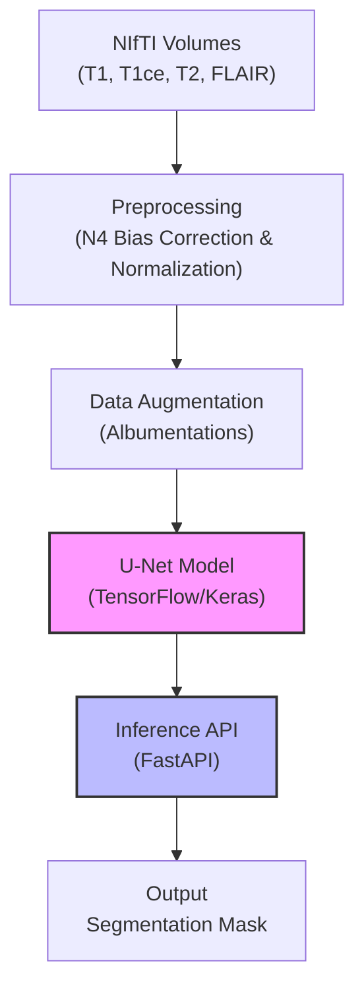

# Brain Tumor Segmentation Pipeline (BraTS 2019)


[](https://www.python.org/)
[](https://www.tensorflow.org/)
[](https://fastapi.tiangolo.com/)
[](https://www.docker.com/)
[](LICENSE)

> **An end-to-end MLOps pipeline for automating Glioma segmentation from multi-modal MRI scans.**

## 📋 Table of Contents
- [Project Overview](#-project-overview)
- [System Architecture](#-system-architecture)
- [Key Features](#-key-features)
- [Project Structure](#-project-structure)
- [Installation & Setup](#-installation--setup)
- [Usage (Training)](#-usage-training)
- [Deployment (Docker & Vertex AI)](#-deployment-docker--vertex-ai)
- [Results](#-results)

---

## 🏥 Project Overview
Glioma segmentation is a critical step in surgical planning and longitudinal tumor tracking. Manual delineation by radiologists is time-consuming and subject to inter-observer variability.

This project implements a production-grade Deep Learning pipeline to automate this process. Using the **BraTS 2019 dataset**, it processes four MRI modalities (T1, T1ce, T2, FLAIR) to predict segmentation masks for tumor sub-regions. The system is engineered for scalability, featuring a modular codebase, containerized inference, and cloud deployment capabilities.

## 🏗 System Architecture



## ✨ Key Features
- **Advanced Preprocessing:** Implements **N4 Bias Field Correction** using SimpleITK to remove RF inhomogeneity artifacts, essential for consistent MRI analysis.
- **Custom U-Net Architecture:** Deep CNN with encoder-decoder paths tailored for semantic segmentation of medical images.
- **Hybrid Loss Function:** Combines **Soft Dice Loss** and **Categorical Crossentropy** to handle extreme class imbalance (small tumor regions vs. large background).
- **Production Engineering:**
    - Modular `src/` layout with separated concerns (data, modeling, training, service).
    - **FastAPI** microservice for real-time inference.
    - **Dockerized** environment optimized with `.dockerignore` and `opencv-python-headless`.

## 📂 Project Structure
```text
brain-tumor-segmentation/
├── configs/               # YAML configuration files
├── src/
│   ├── data/              # Data loading, bias correction, and augmentation
│   ├── models/            # U-Net architecture definition
│   ├── service/           # FastAPI application logic
│   ├── training/          # Training loops and callbacks
│   └── utils/             # Helper functions and config parsers
├── weights/               # Saved model checkpoints (gitignored)
├── Dockerfile             # Production container definition
├── requirements.txt       # Python dependencies
├── train.py               # Training entry point
└── README.md              # Project documentation
```

## ⚙️ Installation & Setup

1. **Clone the repository:**
   ```bash
   git clone https://github.com/kadamrahul18/Classification-of-MRI-images-for-Brain-Tumor-Using-Convolutional-Neural-Networks.git
   cd Classification-of-MRI-images-for-Brain-Tumor-Using-Convolutional-Neural-Networks
   ```

2. **Create a virtual environment:**
   ```bash
   python -m venv venv
   source venv/bin/activate  # On Windows: venv\Scripts\activate
   ```

3. **Install dependencies:**
   ```bash
   pip install -r requirements.txt
   ```

## 🚀 Usage (Training)

**1. Prepare the Data:**
Convert raw BraTS NIfTI files into processed PNG slices.
```bash
python -m src.data.prepare_slices \
  --dataset-root /path/to/brats2019/MICCAI_BraTS_2019_Data_Training \
  --output-root ./Dataset
```

**2. Run Training:**
Start the training loop using the configuration file.
```bash
python train.py --config configs/config.yaml --epochs 20
```
*Artifacts (logs and weights) will be saved to `./outputs/`.*

## 🐳 Deployment (Docker & Vertex AI)

The application is containerized for easy deployment to Google Cloud Platform (Vertex AI) or AWS ECS.

**1. Build the Docker Image:**
```bash
docker build -t brain-seg:latest .
```

**2. Run Locally:**
```bash
docker run -p 8080:8080 brain-seg:latest
```

**3. API Documentation:**
Once running, navigate to `http://localhost:8080/docs` to interact with the Swagger UI.

*   **Endpoint:** `POST /predict`
*   **Input:** Single MRI slice (PNG/JPG)
*   **Output:** Segmentation mask (PNG)

<!-- ## 📊 Results

*(Placeholder: Upload a side-by-side comparison image of "Input MRI" vs "Predicted Mask" to your repo and link it here)*

Example:  -->
