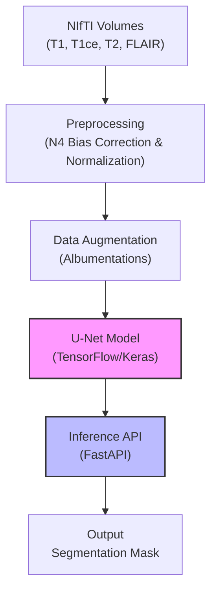

# Brain Tumor Segmentation Pipeline (MSD Task01 + BraTS-compatible)


[](https://www.python.org/)
[](https://www.tensorflow.org/)
[](https://fastapi.tiangolo.com/)
[](https://www.docker.com/)
[](LICENSE)

> **An end-to-end MLOps pipeline for automating Glioma segmentation from multi-modal MRI scans.**

## 📋 Table of Contents
- [Project Overview](#-project-overview)
- [System Architecture](#-system-architecture)
- [Key Features](#-key-features)
- [Project Structure](#-project-structure)
- [Installation & Setup](#-installation--setup)
- [Usage (Training)](#-usage-training)
- [Quick Demo](#-quick-demo)
- [Deployment (Docker & Vertex AI)](#-deployment-docker--vertex-ai)
- [Results](#-results)

---

## 🏥 Project Overview
Glioma segmentation is a critical step in surgical planning and longitudinal tumor tracking. Manual delineation by radiologists is time-consuming and subject to inter-observer variability.

This project implements a production-grade Deep Learning pipeline to automate this process. Using the **MSD Task01_BrainTumour dataset** (and compatible BraTS layouts), it processes four MRI modalities (T1, T1ce, T2, FLAIR) to predict segmentation masks for tumor sub-regions. The system is engineered for scalability, featuring a modular codebase, containerized inference, and cloud deployment capabilities.

## 🏗 System Architecture



## ✨ Key Features
- **Advanced Preprocessing:** Implements **N4 Bias Field Correction** using SimpleITK to remove RF inhomogeneity artifacts, essential for consistent MRI analysis.
- **Custom U-Net Architecture:** Deep CNN with encoder-decoder paths tailored for semantic segmentation of medical images.
- **Hybrid Loss Function:** Combines **Soft Dice Loss** and **Categorical Crossentropy** to handle extreme class imbalance (small tumor regions vs. large background).
- **Production Engineering:**
    - Modular `src/` layout with separated concerns (data, modeling, training, service).
    - **FastAPI** microservice for real-time inference.
    - **Dockerized** environment optimized with `.dockerignore` and `opencv-python-headless`.

## 📂 Project Structure
```text
brain-tumor-segmentation/
├── configs/               # YAML configuration files
├── src/
│   ├── data/              # Data loading, bias correction, and augmentation
│   ├── models/            # U-Net architecture definition
│   ├── service/           # FastAPI application logic
│   ├── training/          # Training loops and callbacks
│   └── utils/             # Helper functions and config parsers
├── weights/               # Saved model checkpoints (gitignored)
├── Dockerfile             # Production container definition
├── requirements.txt       # Python dependencies
├── train.py               # Training entry point
└── README.md              # Project documentation
```

## ⚙️ Installation & Setup

1. **Clone the repository:**
   ```bash
   git clone https://github.com/kadamrahul18/Classification-of-MRI-images-for-Brain-Tumor-Using-Convolutional-Neural-Networks.git
   cd Classification-of-MRI-images-for-Brain-Tumor-Using-Convolutional-Neural-Networks
   ```

2. **Create a virtual environment:**
   ```bash
   python -m venv venv
   source venv/bin/activate  # On Windows: venv\Scripts\activate
   ```

3. **Install dependencies:**
   ```bash
   pip install -r requirements.txt
   ```

## 🚀 3D Pipeline (Recommended)

Install 3D dependencies:
```bash
pip install -r requirements-3d.txt
```

**1. Download the Data (MSD Task01):**
```bash
python scripts/download_msd_task01.py
```

**2. Train 3D U-Net:**
```bash
python -m src.train_3d --config configs/config_3d.yaml
```

**3. Evaluate 3D U-Net:**
```bash
python -m src.eval_3d --config configs/config_3d.yaml --weights outputs/runs/<timestamp>/best.pt
```
This writes `outputs/metrics_3d.json`.

Example output format (placeholder until you run it):
```json
{
  "dataset_format": "msd_task01",
  "label_mode": "binary",
  "val": { "dice_per_class": { "background": null }, "mean_dice": null },
  "test": { "dice_per_class": { "background": null }, "mean_dice": null }
}
```

## 📈 Monitoring
Launch TensorBoard:
```bash
tensorboard --logdir outputs/runs
```
Logged scalars include `loss/train`, `loss/val`, `dice_mean/val`, `lr`, and `gpu_mem_max_mb` (when CUDA is available).
Every `vis_interval` epochs, the run also writes `vis/epoch_XX/` PNGs (input/gt/pred/overlay) and logs overlay grids to TensorBoard.

## ⚡ Speed tuning (V100)
- Reduce ROI size (`96^3`) to improve throughput; larger ROI improves context but slows training.
- Increase `training.num_workers` (start at 8 on 16 CPUs) to reduce data loading stalls.
- Recommended CPU thread caps:
  ```bash
  export OMP_NUM_THREADS=1
  export MKL_NUM_THREADS=1
  ```
- Monitor GPU utilization:
  ```bash
  nvidia-smi -l 1
  ```

## 🚀 2D Baseline (Optional)

**1. Prepare the Data:**
Download MSD Task01_BrainTumour and convert NIfTI volumes into PNG slices.
```bash
python scripts/download_msd_task01.py
python -m src.data.prepare_slices \
  --dataset-format msd_task01 \
  --dataset-root data/raw/msd_task01/Task01_BrainTumour \
  --output-root ./Dataset \
  --slices-per-volume 20 \
  --channel flair \
  --label-mode binary
```

BraTS-compatible input is still supported:
```bash
python -m src.data.prepare_slices \
  --dataset-format brats \
  --dataset-root /path/to/brats_data \
  --output-root ./Dataset
```

**2. Run Training:**
Start the training loop using the configuration file.
```bash
python train.py --config configs/config.yaml --epochs 20
```
*Artifacts (logs and weights) will be saved to `./outputs/`.*

## ⚡ Quick Demo
Run the API locally, upload a PNG slice, and save the predicted mask.

```bash
uvicorn src.service.api:app --host 0.0.0.0 --port 8080
curl -F "file=@example.png" http://localhost:8080/predict -o mask.png
```

## 🐳 Deployment (Docker & Vertex AI)

The application is containerized for easy deployment. For multipart file uploads (`/predict`), Cloud Run is the simplest target.

**1. Build the Docker Image:**
```bash
docker build -t brain-seg:latest .
```

**2. Run Locally:**
```bash
docker run -p 8080:8080 brain-seg:latest
```

**3. API Documentation:**
Once running, navigate to `http://localhost:8080/docs` to interact with the Swagger UI.

*   **Endpoint:** `POST /predict`
*   **Input:** Single MRI slice (PNG/JPG)
*   **Output:** Segmentation mask (PNG)

**Vertex AI custom container usage:**
Vertex AI requires JSON requests; use `POST /vertex/predict` with base64-encoded bytes.
```bash
curl -X POST "http://localhost:8080/vertex/predict" \
  -H "Content-Type: application/json" \
  -d '{
    "instances": [
      {
        "b64": "'"$(base64 -i /path/to/slice.png)"'"
      }
    ]
  }'
```

## 📊 Results
3D evaluation writes per-class Dice scores and mean Dice to `outputs/metrics_3d.json`.
2D evaluation writes to `outputs/metrics.json`.

Example output format (placeholder until you run it):
```json
{
  "dataset_format": "msd_task01",
  "label_mode": "binary",
  "val": { "dice_per_class": { "background": null }, "mean_dice": null },
  "test": { "dice_per_class": { "background": null }, "mean_dice": null }
}
```

**Assumptions:**
- MSD Task01 channel order is assumed to be `[t1, t1ce, t2, flair]` when selecting `--channel`.
- For binary masks, update `configs/config.yaml` to use two classes (e.g., `class_names: [background, tumor]`).
 - Volume inference via API is not implemented yet. TODO: add a NIfTI endpoint for 3D inference.
